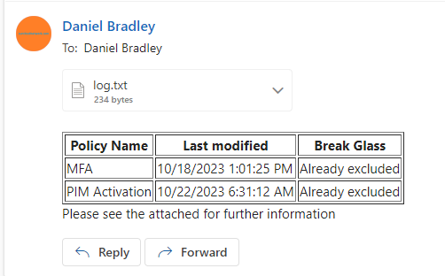

Break-glass accounts are a vital piece to your disaster recovery model. They should be implemented to ensure that when all else fails, you have an entry route back into your organisation. One of the issues is that while they may have been a good thought when they were created, after time, they may not be considered when implementing additional controls, such as Conditional Access policies. This post looks to address and remediate that problem.


# **Purpose of break glass accounts** {#f2fb51e82012453695c5d9b2724f339f}


Break-glass or emergency access accounts are highly privileged (global admin) accounts intended for use, only when all other administrative access is locked out. Effectively, they are the solution to your worst-case scenario, when you have lost access to your primary administrative accounts and the tenant is locked out.


Break-glass accounts should not conform to any other security controls you have in place in your tenant. They are designed to be used without enforcement of Security Defaults or Conditional Access, as them policies often are the cause of the lockout. As such, it is recommended (and essential) that you avoid the use of Security Defaults and enforce Conditional Access policies with user exclusions for your break-glass accounts only.


# **Why break glass accounts need protecting** {#0aaf1c6530ef429dba3808b35f1ce52f}


Throughout the natural lifecycle of your Microsoft 365 tenant, policies, controls and user configurations change due to varying factors, some examples may include:

- The adoption of new integrated software solutions.
- Improvement of existing security controls.
- Onboarding and offboarding of IT staff.

Some of these changes may directly or indirectly impact the usability of your existing break-glass accounts, making them not so useful. This means it is important that you appropriately document your break-glass configuration, making it available to only those who need it and also frequently validate its configuration.


# **Resolving Conditional Access break-glass exclusions with Microsoft Graph PowerShell** {#911a3d479fee4c3ca14ed282e08d57cc}


To ensure you can always log in to your break-glass accounts, it is important that they are excluded from any Conditional Access policy in your environment. Excluding the account from all policies, even when some may not impact the account, is a good practice regardless, in the event the scope of any policy changes without additional thought for the break-glass account further down the line.


Using Microsoft Graph PowerShell and some simple scripting logic, we can gather information about the currently enabled Conditional Access policies in Microsoft Entra and loop through each one to ensure our Break-glass accounts are excluded. We can then email the results to a destination of our choice.


The below example will do just that in a delegate access scenario. _To learn more about permission types with Microsoft Graph, see_ [_How To Find Permissions For Microsoft Graph PowerShell_](https://ourcloudnetwork.com/how-to-find-permissions-for-microsoft-graph-powershell/)_._


```powershell
Connect-MgGraph -Scope Policy.ReadWrite.ConditionalAccess, Policy.Read.All, User.Read.All, Mail.Send

#Define variables#
$breakglass = "address"
$to = "address"
$from = "address" #In a delegate scenario, this must be the account as your current session

#Get breack glass user Id
$userid = (Get-MgUser -userid $breakglass).id
$policies = Get-MgBetaIdentityConditionalAccessPolicy -Filter "State eq 'Enabled'"

#Generate empty arrays
$Report = [System.Collections.Generic.List[Object]]::new()
$log = @()

#Loop through policies, update and build report
Foreach ($policy in $policies){
    If ($userid -in $policy.Conditions.Users.ExcludeUsers) {
        $bgline = "Already excluded"
        $log += "No action required for policy: $($policy.DisplayName)`n"
        $action = "[No action Required]"
    } else {
        $policy.Conditions.Users.ExcludeUsers += $userid
        try {
            update-MgBetaIdentityConditionalAccessPolicy -ConditionalAccessPolicyId $policy.Id -Conditions $policy.Conditions -erroraction stop
            $bgline = "Break glass account added"
            $log += "Break glass account exlcluded for policy: $($policy.DisplayName) `n"
            $action = "[Remediated]"
        }
        Catch {$log += "Unable add breakglass account to policy: $($policy.DisplayName)" + $_ + "`r`n"}
            $action = "[Action Required]"
    }
    $item = [PSCustomObject][ordered]@{
            "Policy Name" = $policy.DisplayName
            "Last modified" = $policy.ModifiedDateTime
            "Break Glass" = $bgline
        }
    $report.Add($item)
}

#Message body
$report = $report | ConvertTo-Html
$Report = $report -replace '<table>', '<table border="1">'

#Message attachment
$encodedBytes = [System.Text.Encoding]::UTF8.GetBytes($log)
$MailAttachment = [System.Convert]::ToBase64String($encodedBytes)

#Send message
$body = @{
	message = @{
		subject = "$action Break glass policy review"
		body = @{
			contentType = "HTML"
			content = "$report Please see the attached for further information"
		}
		toRecipients = @(
			@{
				emailAddress = @{
					address = "$to"
				}
			}
		)
        attachments = @(
			@{
				"@odata.type" = "#microsoft.graph.fileAttachment"
				name = "log.txt"
				contentType = "text/plain"
				contentBytes = $MailAttachment
			}
    )
	}
	saveToSentItems = "false"
}
Send-MgUserMail -UserId $from -BodyParameter $body

```


The output of the script will look like the following:





# **Automating on a schedule with Azure Automation** {#a33d9176107645ed8dce26bdb27b588a}


By automating the above script you can guarantee that it runs on a defined schedule without the need for any physical action. It will also ensure that if a breaking change is made to your existing Conditional Access policies or any new policies, it will automatically be remediated by excluding the break-glass account. There are a few requirements for this step, you will need:

- An Azure subscription.
- [An Azure Automation Account with a system-assigned Managed Identity](https://ourcloudnetwork.com/how-to-run-microsoft-graph-powershell-scripts-with-azure-automation/).
- [To Assign the Graph API permissions to your Managed Identity.](https://ourcloudnetwork.com/assign-permissions-to-a-managed-identity-with-graph-powershell/)
- Modify the script to use the Managed Identity for authentication.

Use the above links to set up an Azure Automation account and assign the relevant permission to the associated Managed Identity; **Policy.ReadWrite.ConditionalAccess, Policy.Read.All**.


# **Modify the script to use a Managed Identity for authentication** {#12afa3ceb5a74ce28affa1a7bd2e9f2f}


To run our script on a schedule securely from the Automation Account, we must modify the script slightly so it uses the managed identity for authentication. To do this, change the first line of the above script to the following:


```powershell
Connect-MgGraph -Identity
```


I like to test this using the Runbook Test pane before publishing it to production. While editing your Runbook, select **Test pane**.


From here you can execute your script to validate it is functioning as expected.


