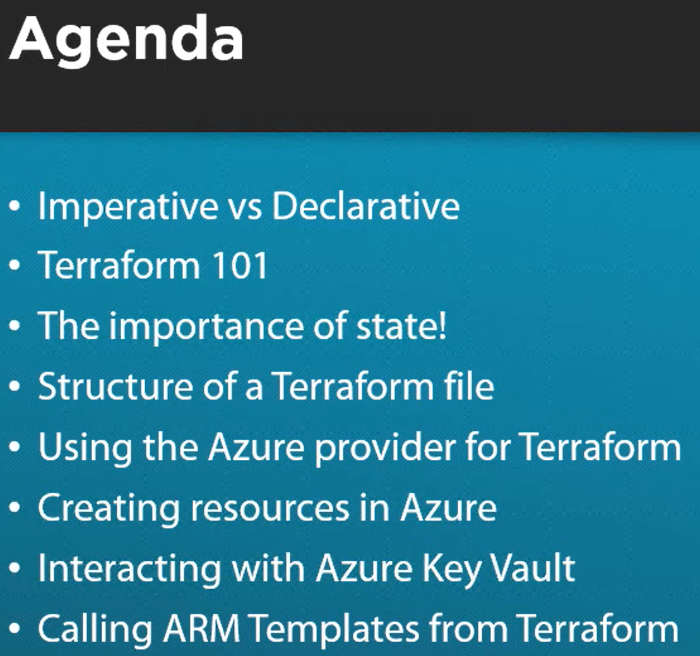
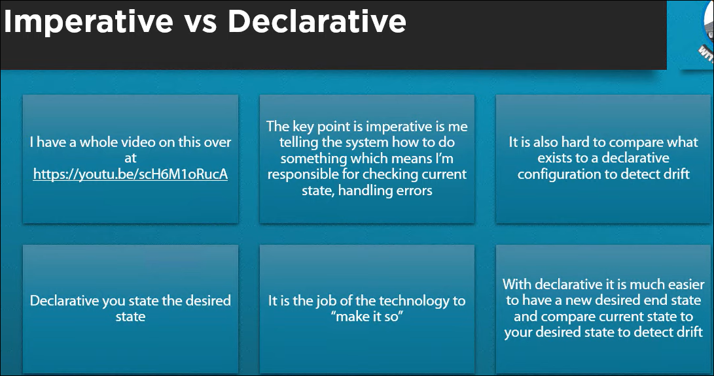

Training Video: [Using Terraform with Azure - YouTube](https://www.youtube.com/watch?v=JKVkblsp3cM) from 2021





**Imperative vs Declarative**





**Azure loves Declarative**


- Resources can be provisioned imperatively using REST API, PowerShell, AZ CLI, and the portal however at its foundation Azures state is stored as JSON.
- Resources are best provisioned using templates
- Natively Azure uses JSON-based ARM Templates
- This is Azure specific and not usable across clouds or for other types of resource


### Terraform 101 {#31e0df37ed9d46798b444322071d41da}


- Terraform is a declarative technology created by HashiCorp
- It uses Terraform text-based configurations with a .tf file type enabling source control integration
- Terra is written in Go and available across platforms as a single binary which you place in the systems path
- Terraform is the **terraform.exe** in Windows
- Providers are being automatically installed if needed
- Terraform is natively available in the Azure cloud shell


**Terraform Key phases**


- We have to create **Create Terraform configuration**
	- Consists typically of 3 files
		- [`main.tf`](http://main.tf/)(my declarative configuration)
		- [`variables.tf`](http://variables.tf/)
		- [`output.tf`](http://output.tf/) (to output information at the end of the job)
- Initialize Terraform configuration
	- `terraform fmt`
		- formats the files correctly and fixes all the tf files in the folder
	- `terraform init`
		- passthrough the files
		- what plugins are being referenced
			- automatically downloads them
		- only run once
- View the changes that will be applied
	- `terraform plan`
		- checks what actions need to be performed
		- is comparing to the statefile
		- creates .terraform folder
- Apply the changes
	- `terraform apply`
		- asks for approval, a-auto-approve can be used
		- creates tfstate file
		- the current state of a resource can be changed by running the command again
			- to change form LRS to GRS `terraform plan -var 'replicationType=GRS"`
	- terraform show
		- shows the tfstate file in a better format
- To visualize
	- `terraform graph`
		- to export 
		`terraform graph > base.bot`
		- can be exported to SVG with Graphviz [https://graphviz.org/](https://graphviz.org/)
		G[raphviz / graphviz · GitLab](https://gitlab.com/graphviz/graphviz)
		`terraform graph | dot -Tsvg > graph.`SVG
- Resolving State Drift
	- terraform refresh
		- If the infrastructure changes outside of Terraform update files


**Tips**

- Parameters can be passed, for example:
	- `terraform plan -var 'replicationType=GRS"`
	- `terraform apply -var 'replicationType=GRS' -auto-approve`

**Terraform State**


- The Terraform Core is responsible for a number of things including state management
- Terraform stores the state of managed resources
	- Terraform creates backups of the tfstate files
- This provides the mapping of resource reality to your resource desired configuration
- State files also track metadata
- State is stored in a local terraform.tfstate file which should NOT be manually edited
- Resources managed by Terraform should NOT be modified outside of Terraform


:::tip

If you are working as a team you must ensure the latest state file is used and nobody uses it at the same time.
Remote state along with state locking can assist.

:::


:::tip

Secrets shouldn't be readable in state files

:::


- Remote backend with Azure Storage can help

**Terraform Code (HCL)**


- Is the declarative language used in the Terraform files
- Documentation as Code
- About 30% less effort to develop compared to ARM


**Anatomy of a Terraform File** 


- Resource
	- Resource use the same format no matter what the provider

		```powershell
		resource "type" "name"{
			parameter1 = "value"
			parameter2 = "value"
		}
		```

- Complete
	- A provider section optional version information

		```powershell
		# Provider Block
		provider "azurerm" {
			version = "=2.11"
			features {}          
		}
		```

	- Data source section to reference existing resources
	- Resource section
- Variable file
	- variables.tf
	- Enables separation of environmental specific values

		```powershell
		variable "environment" {
		  description = "Environment Name"
		  type = string
		  #default = "dev"
		}
		```

	- Main configuration can be version controlled and unmodified between environments and instances
	- Variables are declared and default values can be specified
	- If no default the user will be prompted
	- Can also be set as part of the command line, terraform.tfvars, or environment variables
- Output file
	- Messages and data to be displayed post apply

		```powershell
		output "resource_group_name" {
		  description = "Resource Group name"
		  # Argument Reference
		  value = azurerm_resource_group.myrg.name  
		}
		```


	**Azure Resource Provider**

	- Currently at second major version (v2)
	- Close partnership with Microsoft ensures up-to-date with Azure developments
	- Existing resources must now be imported into state before they can be managed via Terraform
	- As an official plugin distributed by HashiCorp it does not need to be manually installed

	**Creating Azure Resources**

	- Number of quick starts are available at
		- [terraform/quickstart at master · Azure/terraform (github.com)](https://github.com/Azure/terraform/tree/master/quickstart)
		- [Azure Terraform (github.com)](https://github.com/orgs/Azure-Terraform/repositories)
		- [terraform-provider-azurerm/examples at main · hashicorp/terraform-provider-azurerm (github.com)](https://github.com/hashicorp/terraform-provider-azurerm/tree/main/examples)
	- [Docs overview | hashicorp/azurerm | Terraform Registry](https://registry.terraform.io/providers/hashicorp/azurerm/latest/docs)
	Has details on authentication and types of resource


**Interacting with Azure Key Vault**


- Key vault secrets can be used to store sensitive data you do not want in variable or state files
- Ensure the account running Terraform has rights to the secrets in the vault
- Secrets referenced just like any other data source
- Example to get a password;:

	```powershell
	variable "KV" {} #This will pull in value from TF_VAR_KV set in environment variable
	
	data "azurerm_key_vault_secret" "SamplePassword" {
	  name = "SamplePassword"
	  key_vault_id = "${var.KV}"
	}
	
	output "A_Secret_From_KeyVault_Shhhhh" {
	    value = data.azurerm_key_vault_secret.SamplePassword.value
	}
	```


**Other Useful Components**

- File Provisioner
	- Used to copy files into a remote machine
- Remote Exec Provisioner
	- Trigger commands on a remote machine

**Azure DevOps and GitHub Integration**


- Ideally your code is checked in and deployments are automated via pipelines
- There is a marketplace extension for Azure DevOps that adds Terraform tasks to pipelines
- HashiCorp has a setup-terraform GitHub action which adds terraform to the path making its capabilities available


**Calling ARM Templates from Terraform**


- While possible this is discouraged
- HashiCorp work closely with Microsoft to ensure the Azure provider is up-todate
- There is an azurerm_template_deployment that enables ARM JSON to be specified however the created resources will not be managed by Terraform


